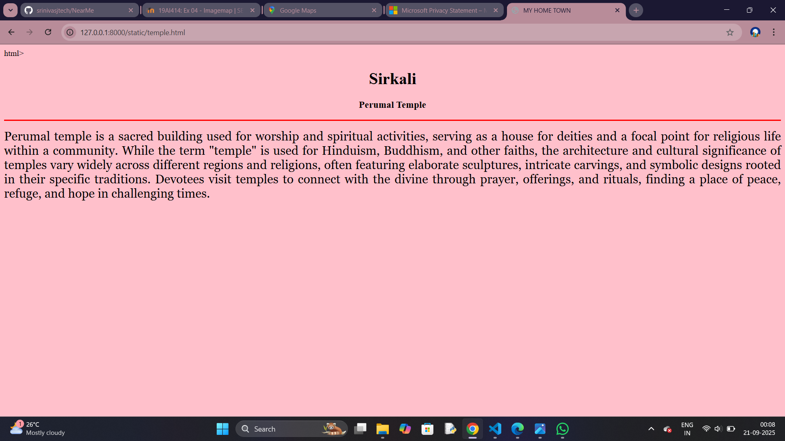
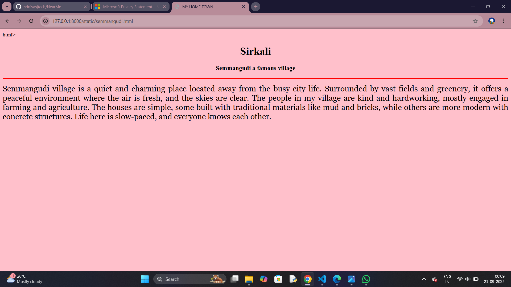
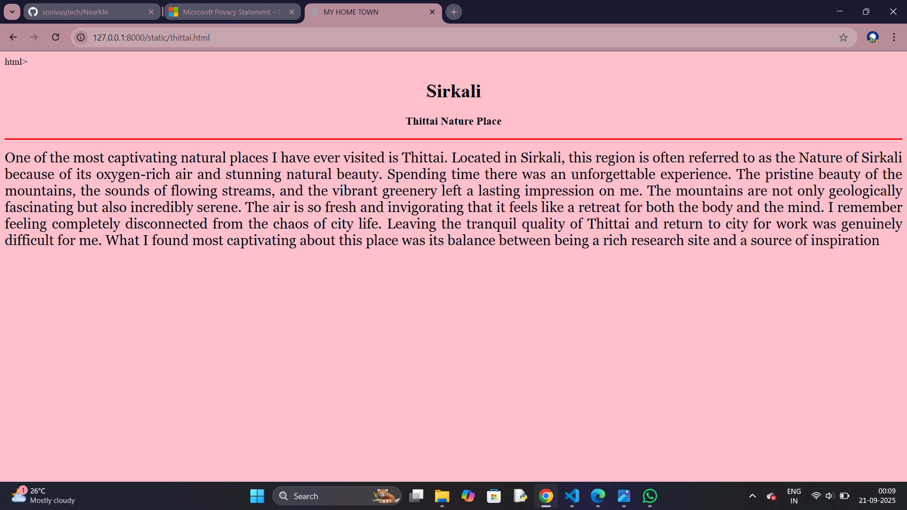
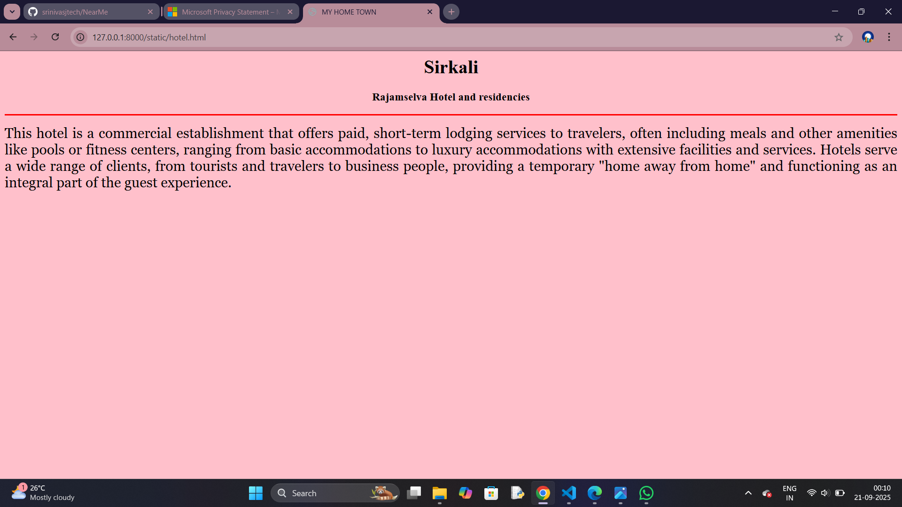
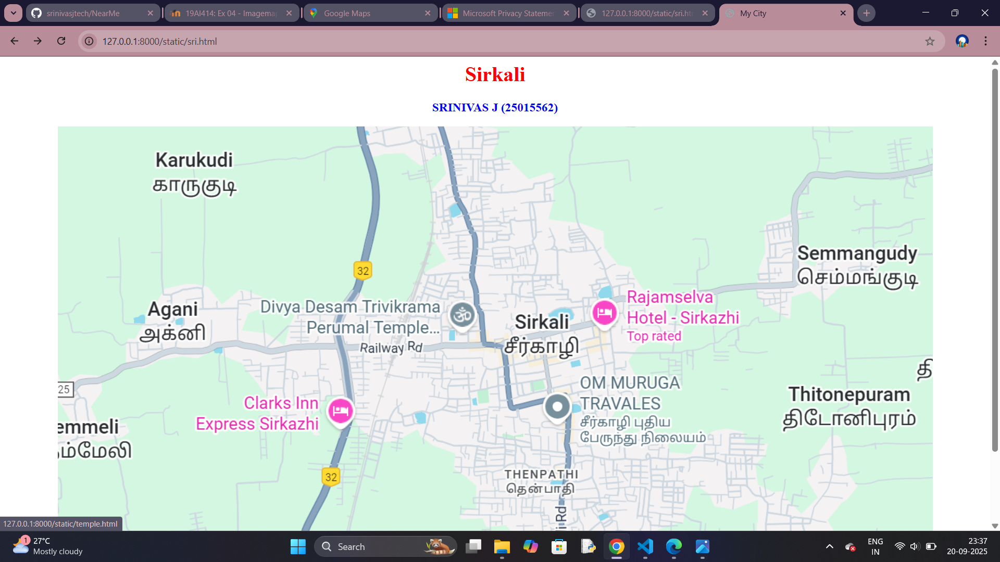

# Ex04 Places Around Me
## Date: 21.09.25

## AIM
To develop a website to display details about the places around my house.

## DESIGN STEPS

### STEP 1
Create a Django admin interface.

### STEP 2
Download your city map from Google.

### STEP 3
Using ```<map>``` tag name the map.

### STEP 4
Create clickable regions in the image using ```<area>``` tag.

### STEP 5
Write HTML programs for all the regions identified.

### STEP 6
Execute the programs and publish them.

## CODE
```
sri.html
<html>
    <head><title>My City</title></head>
    <body><h1 align="center"><font color="red"><b>Sirkali</b></font></h1>
        <h3 align="center"><font color="blue"><b>SRINIVAS J (25015562)</b></font></h3>
<center>

<map name="image-map">
    <area target="" alt="rajamselva hotel" title="rajamselva hotel" href="hotel.html" coords="826,257,1001,332" shape="rect">
    <area target="" alt="perumal temple" title="perumal temple" href="temple.html" coords="323,258,383,258,440,259,383,348,471,341,527,328,558,328,554,347,573,285,542,268,504,262,331,279,351,311,372,337,378,339,427,272,382,332,391,316,397,288,418,282,471,250,340,267,389,324,490,253,393,355,397,341,402,335,407,329,421,313,435,299,454,288,473,267,422,326,444,306,470,282" shape="poly">
    <area target="" alt="thenpathi" title="thenpathi" href="thenpathi.html" coords="734,547,120" shape="circle">
    <area target="" alt="thittai" title="thittai" href="thittai.html" coords="1105,665,69" shape="circle">
    <area target="" alt="semmangudi" title="semmangudi" href="semmangudi.html" coords="1121,176,1326,248" shape="rect">
</map>
</center>
</body>
</html>

semmangudi.html

html>
    <head>
        <title>MY HOME TOWN</title>
    </head>
    <body bgcolor="pink">
        <h1 align="center"><b>Sirkali</b></h1>
        <h3 align="center"><b>Semmangudi a famous village</b></h3>
        <hr size="3" color="red">
        <p align="justify">
            <font face="Georgia" size="5">
                Semmangudi village is a quiet and charming place located away from the busy city life. 
                Surrounded by vast fields and greenery, it offers a peaceful environment where the air is fresh, and the skies are clear. 
                The people in my village are kind and hardworking, mostly engaged in farming and agriculture. The houses are simple, some built with traditional materials like mud and bricks, 
                while others are more modern with concrete structures. Life here is slow-paced, and everyone knows each other.
        </p>
    </body>
</html>

temple.html

html>
    <head>
        <title>MY HOME TOWN</title>
    </head>
    <body bgcolor="pink">
        <h1 align="center"><b>Sirkali</b></h1>
        <h3 align="center"><b>Perumal Temple</b></h3>
        <hr size="3" color="red">
        <p align="justify">
            <font face="Georgia" size="5">
                Perumal temple is a sacred building used for worship and spiritual activities, serving as a house for deities and a focal point 
                for religious life within a community. While the term "temple" is used for Hinduism, Buddhism, and other faiths, the architecture and cultural significance of temples 
                vary widely across different regions and religions, often featuring elaborate sculptures, intricate carvings, and symbolic designs rooted in their specific traditions. 
                Devotees visit temples to connect with the divine through prayer, offerings, and rituals, finding a place of peace, refuge, and hope in challenging times.
        </p>
    </body>
</html>

thenpathi.html

html>
    <head>
        <title>MY HOME TOWN</title>
    </head>
    <body bgcolor="pink">
        <h1 align="center"><b>Sirkali</b></h1>
        <h3 align="center"><b>Thenpathi a famous Town</b></h3>
        <hr size="3" color="red">
        <p align="justify">
            <font face="Georgia" size="5">
               Thenpathi town is a type of human settlement that is generally smaller than a city 
               but larger than a village, though definitions can vary by country and region.
               Towns typically have a diverse economy based on commerce, industry, and public services rather than agriculture,
               and are characterized by a mix of residential areas, shops, local businesses, and public amenities that foster 
               a sense of community among residents. The overall atmosphere of a town can range from bustling and vibrant to quiet 
               and peaceful, with many towns boasting unique cultural landmarks, green spaces, and local traditions.
</html>

thittai.html

html>
    <head>
        <title>MY HOME TOWN</title>
    </head>
    <body bgcolor="pink">
        <h1 align="center"><b>Sirkali</b></h1>
        <h3 align="center"><b>Thittai Nature Place</b></h3>
        <hr size="3" color="red">
        <p align="justify">
            <font face="Georgia" size="5">
                One of the most captivating natural places I have ever visited is Thittai. 
                Located in Sirkali, this region is often referred to as the Nature of Sirkali 
                because of its oxygen-rich air and stunning natural beauty. Spending time there was an unforgettable experience. 
                The pristine beauty of the mountains, the sounds of flowing streams, and the vibrant
                greenery left a lasting impression on me. The mountains are not only geologically
                fascinating but also incredibly serene. The air is so fresh and invigorating that
                it feels like a retreat for both the body and the mind. I remember feeling completely disconnected 
                from the chaos of city life. Leaving the tranquil quality of Thittai and return to city for work was genuinely difficult for me.
                What I found most captivating about this place was its balance between being a rich research site and a source of inspiration
        </p>
    </body>
</html>

hotel.html

<html>
    <head>
        <title>MY HOME TOWN</title>
    </head>
    <body bgcolor="pink">
        <h1 align="center"><b>Sirkali</b></h1>
        <h3 align="center"><b>Rajamselva Hotel and residencies</b></h3>
        <hr size="3" color="red">
        <p align="justify">
            <font face="Georgia" size="5">
                This hotel is a commercial establishment that offers paid, short-term lodging services to travelers, often including meals and other amenities like pools 
                or fitness centers, ranging from basic accommodations to luxury accommodations with extensive facilities and services. Hotels serve a wide range of
                 clients, from tourists and travelers to business people, providing a temporary "home away from home" and functioning as an integral part of the guest experience.
            </font>
        </p>
    </body>
</html>
```

## OUTPUT









## RESULT
The program for implementing image maps using HTML is executed successfully.
